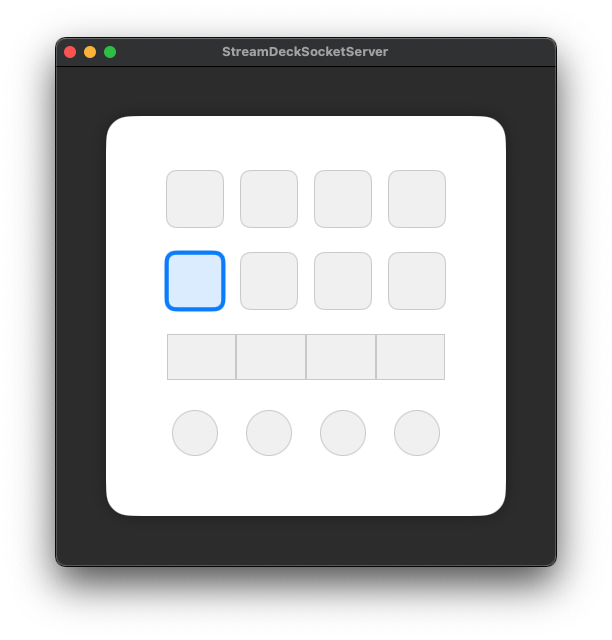

# StreamDeck Socket Server

StreamDeckとmacOSアプリケーションをUnixソケット通信で連携させる、汎用的な制御システムです。StreamDeckからの操作を任意のmacOSアプリケーションに送信し、カスタム制御システムを構築できます。

[English version is here / 英語版はこちら](README.md)

## 🔌 概要

このプロジェクトは、StreamDeckのボタンやダイヤル操作をUnixソケット経由でmacOSアプリケーションに送信する汎用的なサーバーシステムです。StreamDeckからの操作を任意のアプリケーションで受信・処理し、様々な用途に応用可能です。

**音声制御機能**: システムの動作確認とデモンストレーションのために、プロフェッショナルな音楽制御機能を実装しています。DJや音楽制作における直感的な操作を実現し、リアルタイムでのエフェクト制御や複数チャンネルの同時制御が可能です。

## 📦 プロジェクト構成
本ワークスペースは以下の2つのコンポーネントで構成されています：

- **StreamDeckActionPlugin**: StreamDeck側のプラグイン
  - Tap（ボタン押下）・Dial（ダイヤル回転）などの動作を確認できるアクション群
  - Unixソケット経由でmacOSアプリケーションに操作を送信

- **StreamDeckSocketServer**: macOSアプリケーション（サーバー側）
  - Unixソケットサーバーを起動し、StreamDeckからの通信を受信
  - 音声操作処理（デモンストレーション用）を実装

### 構成図

```
StreamDeckWorkSpace/
├── StreamDeckActionPlugin/          # StreamDeckプラグイン
│   └── Sources/Plugins/Actions/     # Tap・Dialアクション群
├── StreamDeckSocketServer/          # macOSアプリケーション
│   ├── Repository/                  # ソケットサーバー・音声処理
│   ├── View/                        # SwiftUI UI
│   └── Resource/Sound/              # 音声ファイル
└── StreamDeckWorkspace.xcworkspace/ # Xcodeワークスペース
```

## 🏗️ アーキテクチャ

```
┌─────────────────┐    Unix Socket   ┌─────────────────┐
│  StreamDeck     │ ←──────────────→ │  macOS App      │
│  Plugin         │                  │  (Server)       │
└─────────────────┘                  └─────────────────┘
                                              │
                                              ▼
                                     ┌─────────────────┐
                                     │ AdvancedSound   │
                                     │ Player          │
                                     └─────────────────┘
                                              │
                                              ▼
                                     ┌─────────────────┐
                                     │ AVAudioEngine   │
                                     │ + Nodes         │
                                     └─────────────────┘
                                              │
                                              ▼
                                     ┌─────────────────┐
                                     │ Audio Output    │
                                     └─────────────────┘
```

## 🚀 セットアップ

### 前提条件
- macOS 15.2以上
- Xcode 16.0以上
- Stream Deck +

### インストール手順

1. **リポジトリのクローン**
```bash
git clone https://github.com/your-username/StreamDeckWorkSpace.git
cd StreamDeckWorkSpace
```

2. **StreamDeckプラグインのビルド・インストール**

⚠️ **重要**: ビルド前に`SocketConfig.swift`のBundle IDを自分のものに書き換えてください。

```swift
// SocketConfig.swift の設定例
let bundleID = "xxx.yyy.zzz" // ← ここを自分のPCのパスと一致するように変更
```


```bash
cd StreamDeckActionPlugin
make build
```

3. **macOSサーバーの起動**
Xcodeで`StreamDeckSocketServer.xcodeproj`を開いて実行

## 🎮 使用方法

### 1. サーバー起動
macOSアプリを起動してUnixソケットサーバーを開始

### 2. StreamDeck側にアクションを設定
1. **StreamDeckアプリを開く**
2. **ボタンに配置**: ドラッグ&ドロップでStreamDeckのボタンに配置

### 3. StreamDeck接続
StreamDeckプラグインが自動的にサーバーに接続

### 4. 音楽制御
- **ボタン押下**: 音声再生、エフェクト切り替え
- **ダイヤル回転**: リアルタイムパラメータ調整

### 5. 操作確認
macOSサーバーアプリの画面で、StreamDeckからの操作が正しく受信されているかをリアルタイムで確認できます。

⚠️ **注意**: 本システムはStream Deck +（ダイヤル付きモデル）にのみ対応しています。従来のStreamDeck（ボタンのみ）では、ボタン数やレイアウトが異なるため、macOSサーバーアプリでの表示確認ができません。



4x4グリッドで操作状態を確認でき、ボタンが押されたり、ダイヤルが回転したりすると、対応するボタンがハイライト表示されます。


## カスタム用途への応用
本システムのUnixソケットサーバーを活用して、以下のような用途に応用可能です：

- **開発ツール制御**: IDE、デバッガー、ビルドツールの操作
- **システム制御**: アプリケーション起動、システム設定変更
- **ワークフロー自動化**: タスクの自動実行、通知制御
- **ゲーム制御**: ゲーム内操作、マクロ実行
- **IoT制御**: スマートデバイス、センサーの操作
- **音楽制御**: 現在実装されている音声制御機能（デモ用）

カスタム用途では、`MessageProcessor.swift`でメッセージ処理ロジックを変更し、任意のアプリケーションとの連携を実現できます。音声制御機能は、システムの動作確認とデモンストレーション用の実装例として参考にしてください。

## 🤝 コントリビューション

1. このリポジトリをフォーク
2. フィーチャーブランチを作成 (`git checkout -b feature/amazing-feature`)
3. 変更をコミット (`git commit -m 'Add amazing feature'`)
4. ブランチにプッシュ (`git push origin feature/amazing-feature`)
5. プルリクエストを作成

## 📝 ライセンス

このプロジェクトはMITライセンスの下で公開されています。詳細は[LICENSE](https://opensource.org/licenses/MIT)を参照してください。

## 🙏 謝辞

- [StreamDeck Plugin SDK](https://github.com/emorydunn/StreamDeckPlugin) - StreamDeckプラグイン開発

## 📞 サポート

問題や質問がある場合は、[Issues](https://github.com/your-username/StreamDeckWorkSpace/issues)で報告してください。

---

**StreamDeck Socket Server** - StreamDeckとmacOSアプリケーションを連携する汎用的な制御システム 🔌