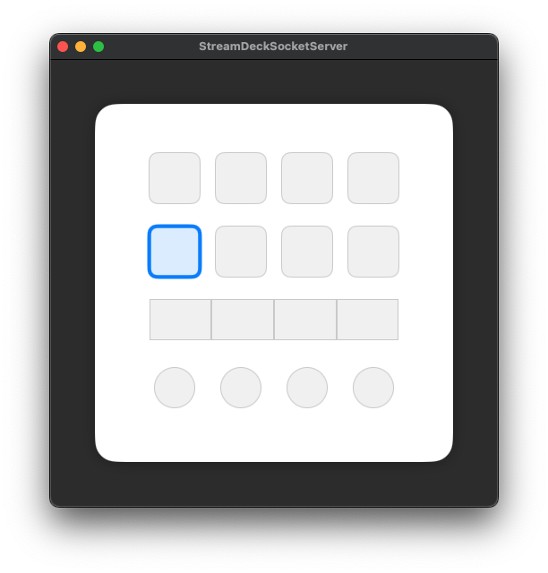

# StreamDeck Socket Server

A versatile control system that connects StreamDeck and macOS applications via Unix socket communication. StreamDeck operations can be sent to any macOS application, enabling custom control system development.

[日本語版はこちら / Japanese version](README.ja.md)

## 🔌 Overview

This project is a versatile server system that sends StreamDeck button and dial operations to macOS applications via Unix sockets. StreamDeck operations can be received and processed by any application, making it applicable to various use cases.

**Audio Control Features**: 


Professional music control functionality is implemented for system operation verification and demonstration purposes. It enables intuitive operations for DJ and music production, with real-time effect control and simultaneous multi-channel control.

### 📦 Project Structure
This workspace consists of the following two components:

- **StreamDeckActionPlugin**: StreamDeck-side plugin
  - Action groups for verifying Tap (button press) and Dial (dial rotation) operations
  - Sends operations to macOS applications via Unix sockets

- **StreamDeckSocketServer**: macOS application (server-side)
  - Starts Unix socket server and receives communications from StreamDeck
  - Implements audio operation processing (for demonstration purposes)

### Structure Diagram

```
StreamDeckWorkSpace/
├── StreamDeckActionPlugin/          # StreamDeck plugin
│   └── Sources/Plugins/Actions/     # Tap・Dial action groups
├── StreamDeckSocketServer/          # macOS application
│   ├── Repository/                  # Socket server・Audio processing
│   ├── View/                        # SwiftUI UI
│   └── Resource/Sound/              # Audio files
└── StreamDeckWorkspace.xcworkspace/ # Xcode workspace
```

## 🏗️ Architecture

```
┌─────────────────┐    Unix Socket   ┌─────────────────┐
│  StreamDeck     │ ←──────────────→ │  macOS App      │
│  Plugin         │                  │  (Server)       │
└─────────────────┘                  └─────────────────┘
                                              │
                                              ▼
                                     ┌─────────────────┐
                                     │ AdvancedSound   │
                                     │ Player          │
                                     └─────────────────┘
                                              │
                                              ▼
                                     ┌─────────────────┐
                                     │ AVAudioEngine   │
                                     │ + Nodes         │
                                     └─────────────────┘
                                              │
                                              ▼
                                     ┌─────────────────┐
                                     │ Audio Output    │
                                     └─────────────────┘
```

## 🚀 Setup

### Prerequisites
- macOS 15.2 or later
- Xcode 16.0 or later
- Stream Deck +

### Installation Steps

1. **Clone Repository**
```bash
git clone https://github.com/your-username/StreamDeckWorkSpace.git
cd StreamDeckWorkSpace
```

2. **Build and Install StreamDeck Plugin**

```bash
cd StreamDeckActionPlugin
make build
```

> Note: The first build may take around few minutes due to dependency resolution and cache generation.

3. **Start macOS Server**
Open `StreamDeckSocketServer.xcodeproj` in Xcode and run

## 🎮 Usage

### 1. Start Server
Launch the macOS app to start the Unix socket server

### 2. Configure Actions on StreamDeck Side
1. **Open StreamDeck App**
2. **Place on Buttons**: Drag and drop to place on StreamDeck buttons

### 3. StreamDeck Connection
StreamDeck plugin automatically connects to the server

### 4. Audio Control
- **Button Press**: Audio playback, effect switching
- **Dial Rotation**: Real-time parameter adjustment

### 5. Operation Verification
You can verify in real-time whether operations from StreamDeck are being received correctly on the macOS server app screen.

⚠️ **Note**: This system only supports Stream Deck + (dial-equipped model). For conventional StreamDeck (buttons only), the button count and layout are different, so display verification on the macOS server app is not possible.



You can check operation status with a 4x4 grid, and when buttons are pressed or dials are rotated, the corresponding buttons are highlighted.

## Custom Applications

This system's Unix socket server can be applied to the following use cases:

- **Development Tool Control**: IDE, debugger, build tool operations
- **System Control**: Application startup, system setting changes
- **Workflow Automation**: Automatic task execution, notification control
- **Game Control**: In-game operations, macro execution
- **IoT Control**: Smart device, sensor operations
- **Audio Control**: Currently implemented audio control functionality (for demonstration)

For custom use cases, modify the message processing logic in `MessageProcessor.swift` to achieve integration with any application. The audio control functionality serves as a reference implementation example for system operation verification and demonstration purposes.

## ✅ Try Without Physical Device

If you don't have a Stream Deck device yet, you can still try this project quickly using the following options:

- Stream Deck Mobile (iPhone/iPad): https://apps.apple.com/app/elgato-stream-deck-mobile/id1440014184
- Virtual Stream Deck (Desktop, requires Stream Deck 7.0+):
  - Japanese: https://www.elgato.com/jp/ja/s/virtual-stream-deck
  - English: https://www.elgato.com/us/en/s/virtual-stream-deck

Note: Button-based actions can be tested easily. Dial-specific actions target Stream Deck + and may have limitations depending on the virtual/mobile environment.

## 🤝 Contributing

1. Fork the repository
2. Create a feature branch (`git checkout -b feature/amazing-feature`)
3. Commit your changes (`git commit -m 'Add some amazing feature'`)
4. Push to the branch (`git push origin feature/amazing-feature`)
5. Create a Pull Request

## 📝 License

This project is licensed under the MIT License. See [LICENSE](https://opensource.org/licenses/MIT) for details.

## 🙏 Acknowledgments

- [StreamDeck Plugin SDK](https://github.com/emorydunn/StreamDeckPlugin) - StreamDeck plugin development

## 📞 Support

If you have any issues or questions, please report them in [Issues](https://github.com/your-username/StreamDeckWorkSpace/issues).

---

**StreamDeck Socket Server** - A versatile control system that connects StreamDeck and macOS applications 🔌
